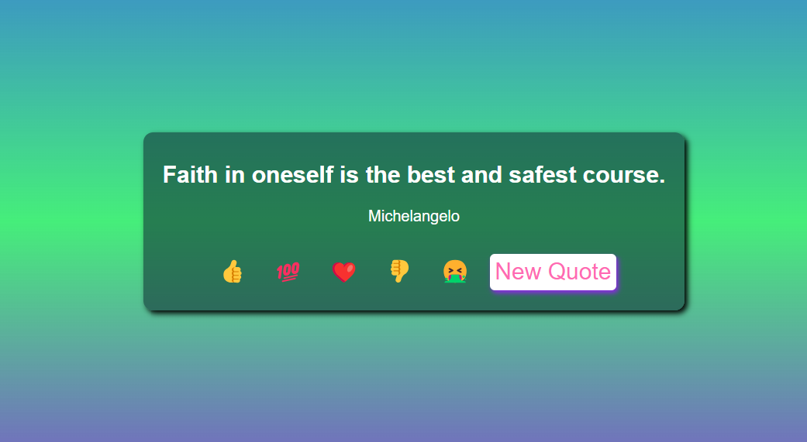
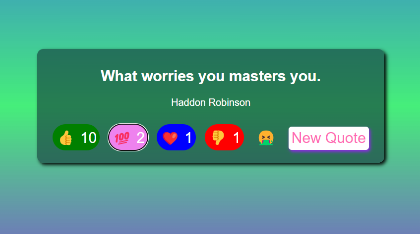

# Qoute Generator

Qoute Generator is an inspiring quote generator that delivers motivation and positivity. Deployed on Netlify, this project provides users with uplifting quotes to brighten their day.

## Overview

Qoute Generator is designed to inspire and motivate users by presenting them with thought-provoking and encouraging quotes. Whether you need a boost of positivity or a moment of reflection, this project is here to uplift your spirits.

## Features

- Randomly generated inspiring quotes.
- Clean and intuitive user interface.
- Deployed on Netlify for seamless accessibility.

## Screenshots

*todays's qoute*

*qoute with reaction*

## Demo

Visit [Your Project URL] to experience the inspiring quotes firsthand: [Your Project URL](https://your-project-netlify-url.netlify.app).

## Getting Started

Explore the uplifting world of Qoute Generator by visiting the project URL mentioned above. Receive a daily dose of motivation and share the positivity with others.

## Deployment

Qoute Generator is deployed on Netlify. For more information on Netlify deployment, refer to [See it](https://qoute-generator.netlify.app).

## Feedback

We welcome your feedback! If you have any suggestions or encounter issues, feel free to open an [issue](https://github.com/your-eziraa/Qoute-generator/issues).

Stay inspired!
